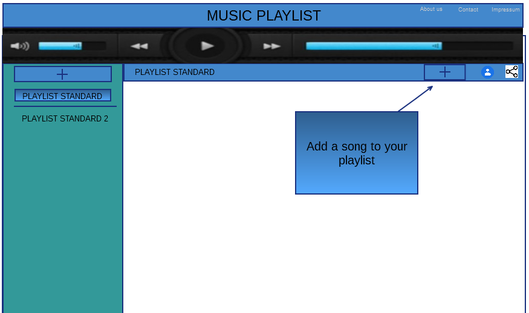
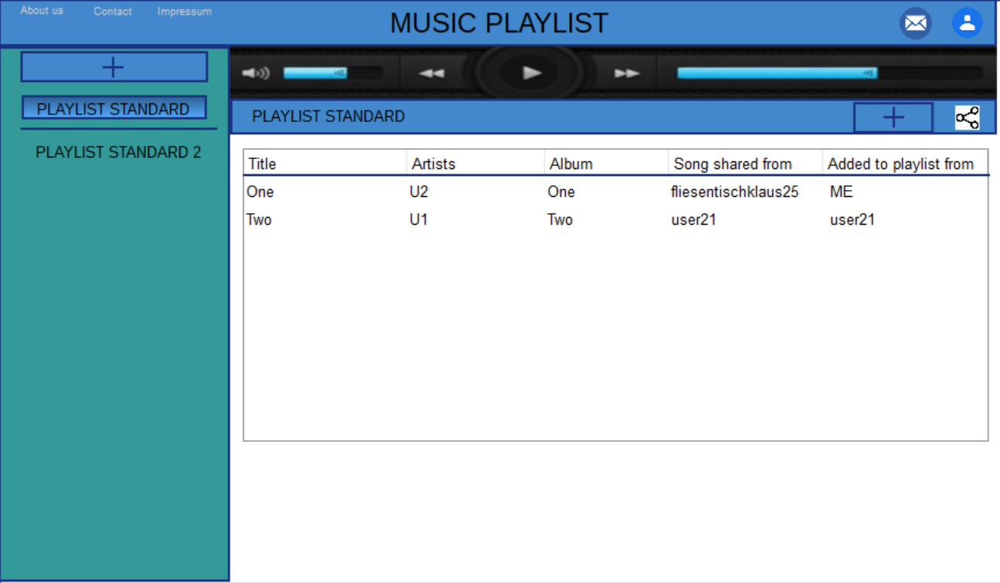
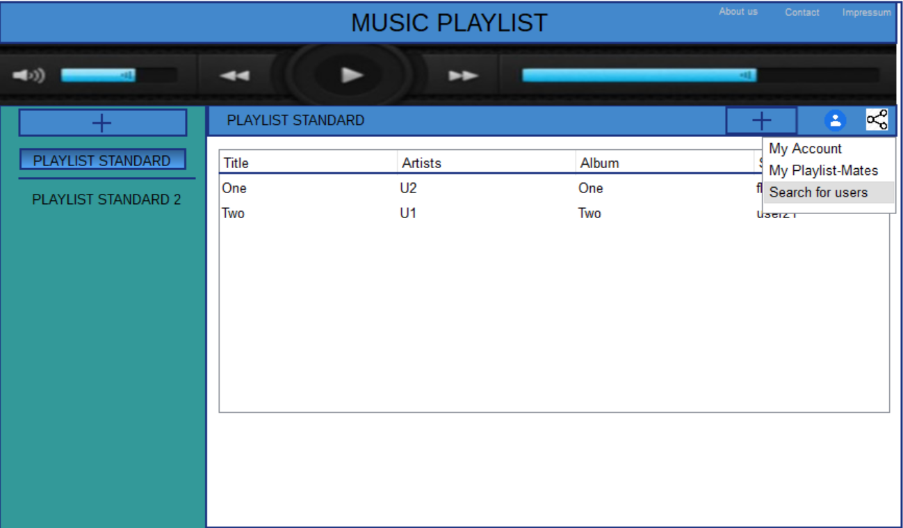
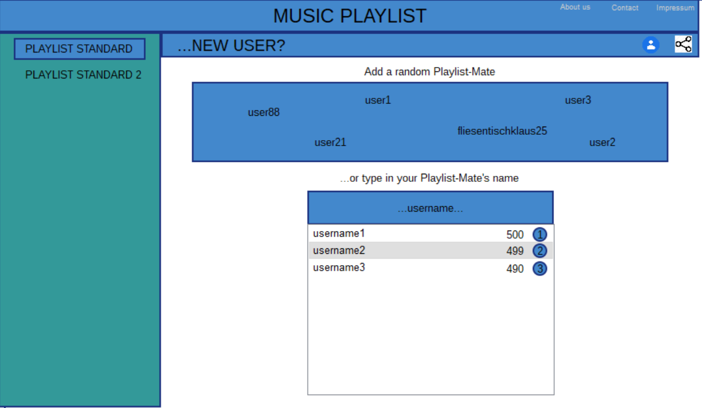
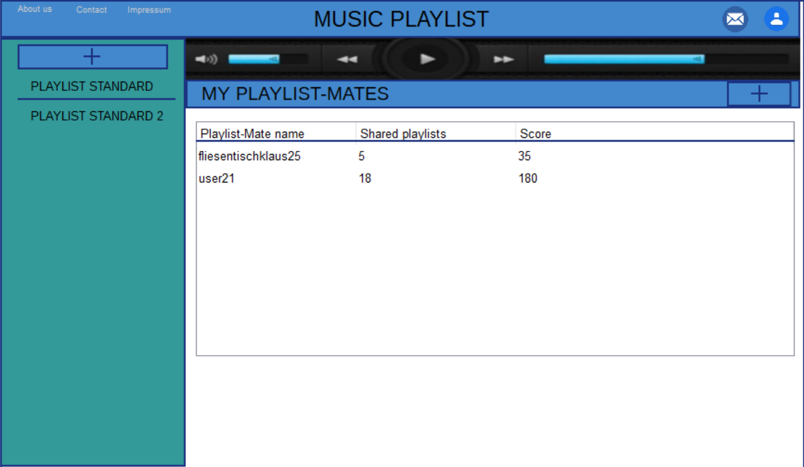
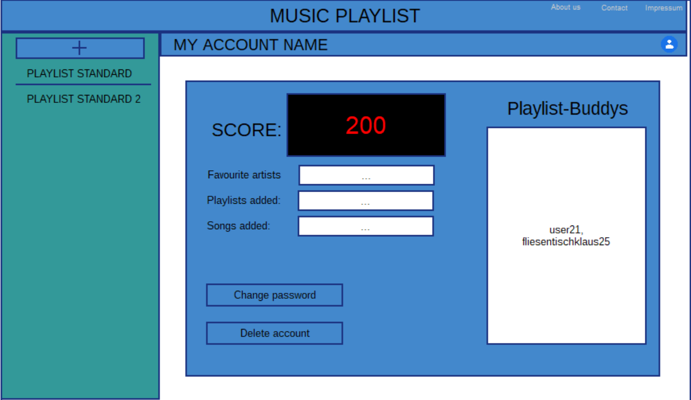
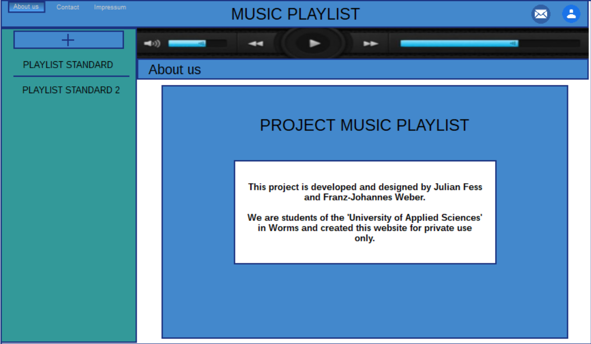
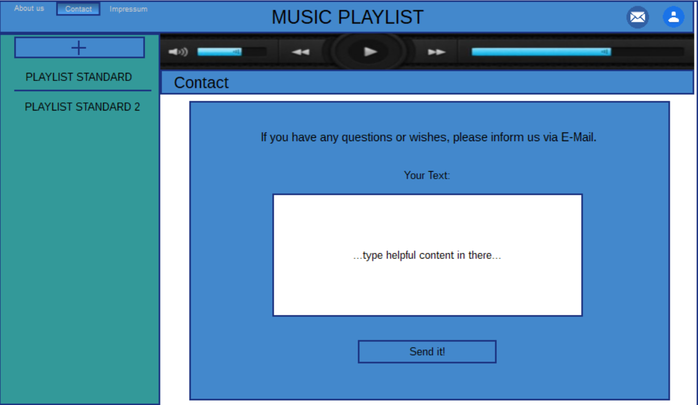

# project FebMusicPlaylist

### Hochschule Worms CSA 151 WS 2018/19

## Inhaltsverzeichnis
##### Allgemeine Informationen
1. [Team](#team)
2. [Abstract](#abstract)
3. [Grundsätzliche Aufgaben (Anforderungen)](#grundstzliche-aufgaben-anforderungen)
4. [Aufgaben des Servers](#aufgaben-des-servers)
5. [Aufgaben des Clients](#aufgaben-des-clients)

##### Wireframes
6. [Page Main](#page-main)
7. [Page PlaylistSongs](#page-playlistsongs)
8. [Page GoToUsers](#page-gotousers)
9. [Page SearchForUsers](#page-searchforusers)
10. [Page MyPlaylistMates](#page-myplaylistmates)
11. [Page MyAccount](#page-myaccount)
12. [Page AboutUs](#page-aboutus)
13. [Page Contact](#page-contact)
14. [Page Impressum](#page-impressum)

##### Aufwandschätzung
15. [Client (Julian Fess)](#client-julian-fess)
16. [Server (Franz-Johannes Weber)](#server-franz-johannes-weber)


## Team
Julian Fess  | Matr. 672836 | inf2819@hs-worms.de</br>          
Franz-Johannes Weber | Matr. 672622 | inf2793@hs-worms.de


## Abstract

Grundsätzlich ist die Idee, eine kleine Web Plattform zum Erstellen und Abspielen von Playlists 
zu entwickeln. Die User der Plattform haben die Möglichkeit Ihre eigenen Playlists zu erstellen.
In die Playlists können User Songs hinzufügen, die in der Server-Datenbank verfügbar sind.
User können andere User zu Ihren Playlist Mates hinzufügen indem sie Ihnen eine Anfrage senden.
Die Playlists sind entweder privat, für Playlist Mates offen oder für alle User öffentlich. Private Playlists können nur vom
User der sie erstellt hat angesehen und angehört werden. Playlists die für Playlist Mates öffentlich gemacht wurden, können von 
den Mates angesehen und angehört werden. Öffentliche Playlists sind für alle User offen zugänglich. Zusätzlich dazu 
können die Playlists mit den Playlist Mates geteilt werden, was den Mates die Mitarbeit an der Playlist ermöglicht. 
Nun können die Playlist Mates beliebig Songs der Playlist hinzufügen oder löschen, sowie die Reihenfolge der Songs 
innerhalb der Playlist verändern.


## Grundsätzliche Aufgaben (Anforderungen)

- User haben Benutzerkonten, Login mit Username und Passwort
- Registrierung für neue User
- User können Playlists erstellen
- User können Songs einer Playlist hinzufügen
- Eigene Songs der User können der Plattform hinzugefügt werden.
- User können andere User zu ihren Playlist-Mates hinzufügen 
- User können Playlist-Mates auch wieder aus der Liste der Playlist-Mates entfernen
- User können Playlisten mit Playlist-Mates teilen und ihnen dadurch Mitarbeit an ihrer Playlist ermöglichen  


## Abstract Client
Verantwortlicher: Julian Fess

- Unten in den Wireframes wird das vorläufige Design des Clients gezeigt
- Der Client muss den Usern ermöglichen ein Benutzerkonto zu erstellen und zu verwalten
    - Dazu gehört Registrierungs-Screen, Login-Screen und Benutzerkontenverwaltung für bereits 
    existierende User
        - Benutzerkontenverwaltung: Hier kann der User seinen Account verwalten. Dazu gehört:
            - Benutzerkonto löschen
            - Passwort ändern
            - Anzeige der eigenen favorisierten Artists 
            - Anzeige wie viele Songs der User bereits hochgeladen hat
            - Anzeige wie viele Playlists der User bereits erstellt hat
            - ein Score wird angezeigt 
            - die Playlist Mates werden absteigend sortiert nach der Anzahl an geteilten Playlists 
            angezeigt
- Desweiteren ermöglicht der Client das Verwalten der von den Usern erstellten Playlists und den darin
enthaltenen Songs
- Im Client ist ein Musik Player enthalten, welcher die Songs aus den Playlists abspielen
kann
- Der Client zeigt ebenfalls eine Liste der Playlist-Mates an welche zusätzlich die Anzahl der Shared playlists
beinhaltet
- Die User können mit Hilfe einer User Suche neue User finden um sie zu Ihren Playlist-Mates hinzuzufügen.
    - Dabei werden einige User random eingeblendet

## Wireframes

### Desktop

### Page Main

Sobald die Main-Page aufgerufen wird, wird der Header mit der App Überschrift
"MUSIC PLAYLIST" erzeugt. Darin befinden sich in der oberen rechten Ecke die einzelnen 
Hyperlinks zu "About Us", "Contact" und "Impressum".
Unmittelbar unter dem Header wird der Musikplayer zu finden sein, welcher mit folgenden
Funktionen ausgestattet sein wird: Titel zurück, Titel vor, Abspielen, Pause, eine Lautstärkeanzeige und
eine Titellängenanzeige. Grafisch soll der Player in einem schmalen horizontalen Layout designed werden.
Auf der linken Seite unterhalb vom Musikplayer wird eine Playlist-Liste zu finden sein, in welcher ein User eine
neue Playlist mittels eines Hinzufüge-Buttons erstellen kann.
Rechts davon ist zunächst lediglich ein weißes Fenster zu erkennen, worin sich ein Textfeld mit der Hilfestellung für das
Hinzufügen eines Titels befindet. Diese Funktion ist auch in der Überschrift-Leiste untergebracht. Außerdem ist darin
ein Button zum Verwalten des eigenen Kontos und der eigenen Kontakte, sowie ein Share Button um die jeweilige 
Playlist mit anderen Benutzern teilen zu können.
                           
### Page PlaylistSongs
 
Ist mindestens ein Titel einer Playlist hinzugefügt worden, so verschwindet das Textfeld mit der Hilfestellung
und eine tabellarische Darstellung zeigt Titelnamen, den Künstler, den Albumnamen, von welchem User der jeweilige
Titel global geteilt wurde und gegebenenfalls welcher Playlist-Mate den Titel der Playlist hinzugefügt hat.
Jede Zeile wird dabei klickbar sein, sodass nach jedem Klick der entsprechende Titel abgespielt werden kann.

### Page GoToUsers
 
In der Page GoToUsers sieht man welche Möglichkeiten dem User nach einem Klick auf das User Symbol
ermöglicht werden. Insgesamt gibt es drei Auswahlmöglichkeiten: MyAccount, MyPlaylist Mates
und SearchForUsers. Auswahl MyAccount bietet dem User die Möglichkeit seine Account Informationen aufzurufen, 
welche in Page MyAccount gezeigt und erläutert werden. Wählt der User die Auswahl MyPlaylist-Mates, so werden ihm
seine Playlist-Mates, wie bei Page MyPlaylistMates dargestellt, angezeigt. Entscheidet sich der User
für SearchForUsers so wird ihm die Möglichkeit gegeben, wie in Page SearchForUsers beschrieben, neue User zu finden und ihnen eine
Playlist-Mate Anfrage zu senden. 

### Page SearchForUsers

Auf dieser Seite befindet sich unterhalb der Seitenüberschrift "...NEW USER?" eine Box mit randomisierten Benutzern darin.
Jeder Benutzernamen innerhalb der Box kann selektiert werden, um im Anschluss dessen Benutzerprofil in einer Popup-Box zu erhalten.
Dabei wird je nach Berechtigungsstatus das ausgewählte Benutzerprofil entweder frei einsehbar oder mit nicht sichtbaren, 
verdeckten Profildaten angezeigt. Im Übrigen ist in jedem fremden Profilfenster ein Button für eine Playlist-Mate-Anfragen
untergebracht. Dadurch soll es allen Benutzern ermöglicht werden, auch Lieblingsmusik von zufällig ausgewählten Benutzern
sich anzuhören. Ist der Benutzer bereits als Playlist-Mate im eigenen Profil gelistet, so taucht statt dem Button für eine
Playlist-Mate-Anfrage ein Button für zum Löschen des Playlist-Mates auf.
Schaut man auf der Page SearchForUsers nochmals etwas weiter nach unten, so findet man ein Texteingabefeld für die
Benutzersuche, damit gezielt bestimmte Benutzer gefunden werden können. Sobald der suchende Benutzer mindestens ein Zeichen
in das Eingabefeld eingibt, wird automatisch nach passenden Benutzernamen gesucht und die Ergebnisse werden in einer Liste direkt
unter dem Texteingabefeld präsentiert. Dazu ist jeder Benutzer mit einem Punktestand (Score) und einer Platzierung (Rank)
versehen. Die Platzierung ergibt sich aus dem Punktestand der jeweiligen gefundenen Benutzer. Der Punktestand-Wert soll auf einem
Blick vermitteln, wie engagiert ein Benutzer an seinen eigenen und auch anderen Playlists arbeitet. Klickt man auch hier wieder
auf einen Benutzernamen, öffnet sich eine Popup-Box mit den entsprechenden Benutzerprofildaten und den jeweiligen Buttons.

### Page MyPlaylistMates

Page MyPlaylistMates liefert dem User eine aplphabetisch sortierte, tabellarische Ansicht seiner bereits hinzugefügten Playlist-Mates. Dargestellt werden
in der Tabelle die Attribute: Playlist-Mate name, Shared playlists und der Score des einzelnen Playlist-Mates. Attribut Playlist-Mate name zeigt den
Usernamen des Playlist-Mates an. Score den Score des jeweiligen Mates. Das Attribut Shared playlists gibt beschreibt, wie viele Playlists in diesem 
Moment mit dem jeweiligen Playlist-Mate zusammen bearbeitet werden. Bei einem Klick
auf einen der Playlist-Mates erscheint eine Popup Box, welche dem User ermöglicht diesen Playlist-Mate aus der
Liste der Playlist-Mates zu entfernen.

### Page MyAccount

In Page MyAccount findet der User alle wichtigen Informationen die seinen eigenen Account betreffen.
Dazu gehört die Darstellung seines Scores auf der Plattform, als auch generelle Informationen wie Favourite artists, 
playlists added oder songs added. Ein Fenster rechts liefert dem User eine Ansicht seiner beliebtesten Playlist-Mates.
Diese werden absteigend nach der Anzahl an zusammen bearbeiteten Playlists sortiert.  
Auf dieser Seite bekommt der User dadurch auch die Möglichkeit sein Passwort zu ändern oder gar seinen Account zu
löschen.

### Page AboutUs

Hier sind allgemeine Informationen über die Entwickler und über das Projekt "Music Playlist" zu finden.

### Page Contact

Über den Hyperlink Contact gelangt man in das Kontaktfenster. Jedem angemeldeten Benutzer ist es erlaubt, eine Nachricht
an die Entwickler via E-Mail zu senden, damit eventuelle Fragen, Wünsche oder etwa Kritik zur Verbesserung der gesamten
Website angenommen und umgesetzt werden können. Ist ein Text verfasst und möchte abgeschickt werden, so geschieht dies
mit Hilfe des Buttons "Send it!". Dabei wird eine E-Mail mit dem erstellten Text und dem Benutzernamen inklusive ID an
die Projekt-E-Mail-Adresse gesendet.

### Page Impressum

Auf dieser Seite sind die genauen Entwicklerdaten der Homepage und eine Kontakt-E-Mail-Adresse angegeben.

### Mobil


## Abstract Server
Verantwortlicher: Franz Johannes Weber

   - Auf dem Server muss eine Datenbank vorhanden sein, die:
      - (lizensfreie) Musik in einer Tabelle Songs beinhaltet
      - die Playlists der einzelnen User beinhaltet
      - die User Daten der User beinhaltet
          - Tabelle Songs
              - Attribute: SongID (primary), Titel, Artist, Album, Uploader (derjenige der den Titel auf die Plattform hochgeladen hat)
          - Tabelle Playlists
              - Attribute: PlaylistID (primary), Name, collaborator_username (foreign)
          - Tabelle User
              - Attribute: username (primary), password
          - Tabelle PlaylistContains
              - Attribute: PlaylistID (foreign), SongID (foreign)
          - Tabelle PlaylistFrom
              - Attribute: PlaylistID (foreign), username (foreign)
          - Tabelle PlaylistMate (User sind mit anderen Usern befreundet)
              - Attribute: username (foreign), username_playlistmate (foreign)
   - Die Datenbank ist erweiterbar, damit neue Songs von den Usern hinzugefügt werden können)
   - Der Server liefert dem Client abspielbare Musik in Form eines Streams
   - Die User Daten (Benutzername, Passwort) werden vom Server beim Login überprüft

### ORM

### API-Beschreibung
Bei Aufruf von https://www.127.0.0.1:3000/username
```
 GET /username
```
In dieser Route nimmt der Server einen username entgegen.
Als Antwort liefert er einen user mit dem Benutzernamen username.

````
 POST /username
````
In dieser Route nimmt der Server einen username entgegen.
Als Anweisung legt er einen neuen user mit dem Benutzernamen username an.

````
 PUT /username
````
In dieser Route nimmt der Server einen username entgegen.
Als Anweisung legt er einen neuen user mit dem Benutzernamen username an.

````
 DELETE /username
````
In dieser Route nimmt der Server einen username entgegen.
Als Anweisung löscht er einen user mit dem Benutzernamen username.

### Template Object

```json5
{
  username: "fliesentischklaus25",
  passwordHashSha2: "ba9b353684f9ae6badc6e11a2f534d3a0a6cd4d625174b2e6b216ba32498c524",
  playlistsAdded: 5,
  songsAdded: 30,
  score: 100,
  playlistMates: ["user21", "user55"]
}
```

```json5
{
  
}
```

## Aufwandsschätzung

### Frontend
Verantwortlicher: Julian Fess

#### Projektvorbereitung

| Aufgabe | Zeit in Stunden |
|----------|:-------------:|
| Projektplanung (Wireframes, README)  | 10 |
| Login Screen und Registrierungs Screen bauen| 15 |
| Main Page mit Playlist Auswahl Menü erstellen | 20 | 
| Musikplayer integrieren| 10 |
| Playlist Share zwische Playlist Mates ermöglichen, Share Button möglicherweise mit drag and drop | 15 |
| Screen für die Anzeige der Playlist Mates | 10 |
| SearchForUsers erstellen und Random User anzeigen lassen + Möglichkeit bieten User untereinander als Playlist Mates zu connecten (Anfrage etc.)| 15 |
| Projektdokumentation | 15 |
| GESAMT | 25 |

#### Implementierung

| Aufgabe | Zeit in Stunden |
|----------|:-------------:|
| Projektplanung (Wireframes, README)  | 10 |
| Login Screen und Registrierungs Screen bauen| 15 |
| Main Page mit Playlist Auswahl Menü erstellen | 20 | 
| Musikplayer integrieren| 10 |
| Playlist Share zwische Playlist Mates ermöglichen, Share Button möglicherweise mit drag and drop | 15 |
| Screen für die Anzeige der Playlist Mates | 10 |
| SearchForUsers erstellen und Random User anzeigen lassen + Möglichkeit bieten User untereinander als Playlist Mates zu connecten (Anfrage etc.)| 15 |
| Projektdokumentation | 15 |
| GESAMT | 50 |

#### Dokumentation und Tests

| Aufgabe | Zeit in Stunden |
|----------|:-------------:|
| Projektplanung (Wireframes, README)  | 10 |
| Login Screen und Registrierungs Screen bauen| 15 |
| Main Page mit Playlist Auswahl Menü erstellen | 20 | 
| Musikplayer integrieren| 10 |
| Playlist Share zwische Playlist Mates ermöglichen, Share Button möglicherweise mit drag and drop | 15 |
| Screen für die Anzeige der Playlist Mates | 10 |
| SearchForUsers erstellen und Random User anzeigen lassen + Möglichkeit bieten User untereinander als Playlist Mates zu connecten (Anfrage etc.)| 15 |
| Projektdokumentation | 15 |
| Summe | 25 |

#### Zusammenfassung

| Teil | Zeit in Stunden |
|----------|:-------------:|
| Projektvorbereitung | 25 |
| Implementierung | 50 |
| Projektdokumentation | 25 |
| Summe  | 100 |

### Backend
Verantwortlicher: Franz Johannes Weber

#### Projektvorbereitung

| Aufgabe | Zeit in Stunden |
|----------|:-------------:|
| Projektplanung (Wireframes, README) | 10 |
| Datenbank aufbauen und verwalten | 15 |
| Filestreaming konfigurieren | 10 |
| My Account Screen entwickeln | 15 |
| User-Suche und Rankingsystem implementieren | 10 |
| Zufälliger User Screen erstellen | 10 |
| About us, Contact und Impressum anfertigen und designen | 5 |
| Playlist Teilen-Funktionen (als Email-Text oder mit User) einbinden | 10 |
| Projektdokumentation | 15 |
| GESAMT | 100 |

#### Implementierung

| Aufgabe | Zeit in Stunden |
|----------|:-------------:|
| Projektplanung (Wireframes, README)  | 10 |
| Login Screen und Registrierungs Screen bauen| 15 |
| Main Page mit Playlist Auswahl Menü erstellen | 20 | 
| Musikplayer integrieren| 10 |
| Playlist Share zwische Playlist Mates ermöglichen, Share Button möglicherweise mit drag and drop | 15 |
| Screen für die Anzeige der Playlist Mates | 10 |
| SearchForUsers erstellen und Random User anzeigen lassen + Möglichkeit bieten User untereinander als Playlist Mates zu connecten (Anfrage etc.)| 15 |
| Projektdokumentation | 15 |
| GESAMT | 50 |

#### Dokumentation und Tests

| Aufgabe | Zeit in Stunden |
|----------|:-------------:|
| Projektplanung (Wireframes, README)  | 10 |
| Login Screen und Registrierungs Screen bauen| 15 |
| Main Page mit Playlist Auswahl Menü erstellen | 20 | 
| Musikplayer integrieren| 10 |
| Playlist Share zwische Playlist Mates ermöglichen, Share Button möglicherweise mit drag and drop | 15 |
| Screen für die Anzeige der Playlist Mates | 10 |
| SearchForUsers erstellen und Random User anzeigen lassen + Möglichkeit bieten User untereinander als Playlist Mates zu connecten (Anfrage etc.)| 15 |
| Projektdokumentation | 15 |
| Summe | 25 |

#### Zusammenfassung

| Teil | Zeit in Stunden |
|----------|:-------------:|
| Projektvorbereitung | 25 |
| Implementierung | 50 |
| Projektdokumentation | 25 |
| Summe  | 100 |