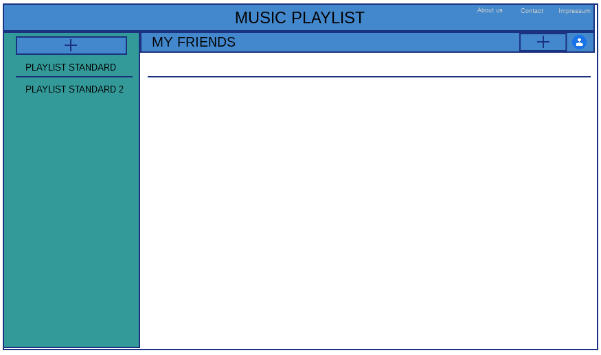

#project FebMusicPlaylist

##Team
Das Team besteht aus Julian Fess (Matr. 672836) und Franz-Johannes Weber 
(Matr. 672622).

## Idee
Grundsätzlich ist die Idee, eine kleine Web Plattform zum Erstellen und Abspielen von Playlists 
zu entwickeln. Die User der Plattform haben die Möglichkeit Ihre eigenen Playlists zu erstellen.
In die Playlists können User Songs hinzufügen, die in der Server-Datenbank verfügbar sind.
User können andere User zu Ihren Playlist Mates hinzufügen indem sie Ihnen eine Anfrage senden.
Die Playlists sind entweder privat, für Playlist Mates offen oder für alle User öffentlich. Private Playlists können nur vom
User der sie erstellt hat angesehen und angehört werden. Playlists die für Playlist Mates öffentlich gemacht wurden, können von 
den Mates angesehen und angehört werden. Öffentliche Playlists sind für alle User offen zugänglich. Zusätzlich dazu 
können die Playlists mit den Playlist Mates geteilt werden, was den Mates die Mitarbeit an der Playlist ermöglicht. 
Nun können die Playlist Mates beliebig Songs der Playlist hinzufügen oder löschen, sowie die Reihenfolge der Songs 
innerhalb der Playlist verändern.

## Grundsätzliche Aufgaben (Anforderungen)

- User haben Benutzerkonten, Login mit Username und Passwort
- Registrierung für neue User
- User können Playlists erstellen
- User können Songs einer Playlist hinzufügen
- Eigene Songs der User können der Plattform hinzugefügt werden.
- User können andere User zu ihren Playlist Mates hinzufügen
- User können Playlisten mit Playlist Mates teilen und Ihnen dadurch Mitarbeit an ihrer Playlist ermöglichen  

##Aufgaben des Servers

- Auf dem Server muss eine Datenbank vorhanden sein, die:
    - (lizensfreie) Musik in einer Tabelle Songs beinhaltet 
    - die Playlists der einzelnen User beinhaltet
    - die User Daten der User beinhaltet 
        - Tabelle Songs 
            - Attribute:  SongID (primary), Titel, Artist, Album, Uploader (derjenige der den Titel auf die Plattform hochgeladen hat)
        - Tabelle Playlists
            - Attribute: PlaylistID (primary), Name 
        - Tabelle User
            - Attribute: username (primary), password
        - Tabelle PlaylistContains
            - Attribute: PlaylistID (foreign), SongID (foreign)
        - Tabelle PlaylistFrom
            - Attribute: PlaylistID (foreign), username (foreign)
        - Tabelle PlaylistMate (User sind mit anderen Usern befreundet)
            - Attribute: username (foreign), username_playlistmate (foreign) 
- Die Datenbank ist erweiterbar, damit neue Songs von den Usern hinzugefügt werden
können)
- Der Server liefert dem Client abspielbare Musik in Form eines Streams
- Die User Daten (Benutzername, Passwort) werden vom Server beim Login überprüft

## Aufgaben des Clients

- Unten in den Wireframes wird das vorläufige Design des Clients gezeigt
- Der Client muss den Usern ermöglichen ein Benutzerkonto zu erstellen und zu verwalten
    - Dazu gehört Registrierungs-Screen, Login-Screen und Benutzerkontenverwaltung für bereits 
    existierende User
        - Benutzerkontenverwaltung: Hier kann der User seinen Account verwalten. Dazu gehört:
            - Benutzerkonto löschen
            - Passwort ändern
            - Anzeige der eigenen favorisierten Artists 
            - Anzeige wie viele Songs der User bereits hochgeladen hat
            - Anzeige wie viele Playlists der User bereits erstellt hat
            - ein Score wird angezeigt 
            - die Playlist Mates werden absteigend sortiert nach der Anzahl an geteilten Playlists 
            angezeigt
- Desweiteren ermöglicht der Client das Verwalten der von den Usern erstellten Playlists und den darin
enthaltenen Songs
- Im Client ist ein Musik Player enthalten, welcher die Songs aus den Playlists abspielen
kann
- Der Client zeigt ebenfalls eine Liste der Playlist Mates an welche zusätzlich die Anzahl der shared Playlists
beinhaltet
- Die User können mit Hilfe einer User Suche neue User finden um sie als Playlist Mates hinzuzufügen.
    - Dabei werden einige User random eingeblendet

## Aufwandsschätzung

###Client (Julian Fess)

| Teilaufgabe   | Zeit in Stunden |
|----------|:-------------:|
| Projektplanung (Wireframes, README)  | 10 |
| Login Screen und Registrierungs Screen bauen| 15 |
| Main Page mit Playlist Auswahl Menü erstellen | 20 | 
| Musikplayer integrieren| 10 |
| Playlist Share zwische Playlist Mates ermöglichen, Share Button möglicherweise mit drag and drop | 15 |
| Screen für die Anzeige der Playlist Mates | 10 |
| SearchForUsers erstellen und Random User anzeigen lassen + Möglichkeit bieten User untereinander als Playlist Mates zu connecten (Anfrage etc.)| 15 |
| Projektdokumentation | 15 |
| GESAMT | 100 |

###Server (Franz-Johannes Weber)

| Teilaufgabe   | Zeit in Stunden |
|----------|:-------------:|
| Projektplanung (Wireframes, README) | 10 |
| Datenbank aufbauen und verwalten | 15 |
| Filestreaming konfigurieren | 10 |
| My Account Screen entwickeln | 15 |
| User-Suche und Rankingsystem implementieren | 10 |
| Zufälliger User Screen erstellen | 10 |
| About us, Contact und Impressum anfertigen und designen | 5 |
| Playlist Teilen-Funktionen (als Email-Text oder mit User) einbinden | 10 |
| Projektdokumentation | 15 |
| GESAMT | 100 |

## Wireframes

### Page Main

Sobald die Main-Page aufgerufen wird, wird der Header mit der App Überschrift
"MUSIC PLAYLIST" erzeugt. Darin befinden sich in der oberen rechten Ecke die einzelnen 
Links zu den Websites "About Us", "Contact" und "Impressum".
Unmittelbar unter dem Header wird der Musikplayer zu finden sein, welcher mit folgenden
Funktionen ausgestattet sein wird: Titel zurück, Titel vor, Abspielen, Pause, eine Lautstärkeanzeige und
eine Titellängenanzeige. Grafisch soll der Player in einem schmalen horizontalen Layout designed werden.
Auf der linken Seite unterhalb vom Musikplayer wird eine Playlist-Liste zu finden sein, in welcher ein User eine
neue Playlist mittels eines Hinzufüge-Buttons erstellen kann.
Rechts davon befindet sich zunächst nur ein weißes Fenster, worin sich ein Textfeld mit der Hilfestellung für das
Hinzufügen eines Titels befindet. Diese Funktion ist auch in der Überschrift-Leiste untergebracht. Außerdem ist darin
ein Button zum Verwalten des eigenen Kontos und der eigenen Kontakte, sowie ein Share Button um die jeweilige 
Playlist mit anderen Benutzern teilen zu können.
                           
### Page PlaylistSongs
 
Ist mindestens ein Titel einer Playlist hinzugefügt worden, so verschwindet das Textfeld mit der Hilfestellung
und eine tabellarische Darstellung zeigt Titelnamen, den Künstler, den Albumnamen, von welchem User der jeweilige
Titel global geteilt wurde und gegebenenfalls welcher Playlist-Mate den Titel der Playlist hinzugefügt hat.
Jede Zeile wird dabei klickbar sein, sodass nach jedem Klick der entsprechende Titel abgespielt werden kann.

### Page GoToUsers
 
In der Page GoToUsers sieht man welche Auswahlmöglichkeiten der User
### Page SearchForUsers

### Page MyFriends

### Page MyAccount

