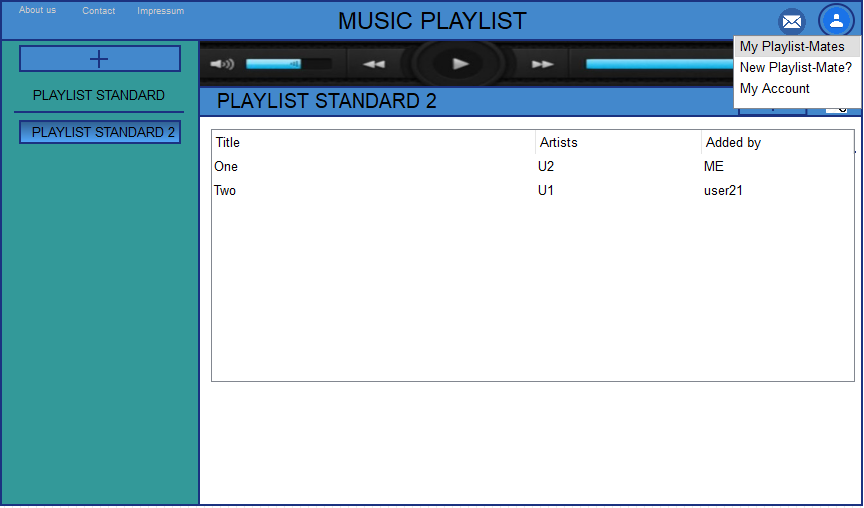
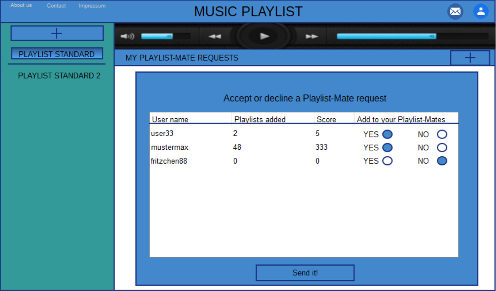

# project FebMusicPlaylist

### Hochschule Worms CSA 151 WS 2018/19

  
## Inhaltsverzeichnis
##### Allgemeine Informationen
  1. [Team](#team)
  2. [Abstract](#abstract)
  3. [Grundsaetzliche Aufgaben (Anforderungen)](#grundsaetzliche-aufgaben--anforderungen-)
  4. [Abstract Client](#abstract-client)
##### Wireframes 
  5. [Wireframes](#wireframes)
   6. [Desktop](#desktop)
      - [Page Login](#page-login)
      - [Page Registration](#page-registration)
      - [Page FirstSteps](#page-firststeps)
      - [Page AddNewSongToPlaylist](#page-addnewsongtoplaylist)
      - [Page SongWasAdded](#page-songwasadded)
      - [Page AddNewPlaylist](#page-addnewplaylist)
      - [Page NewPlaylistAdded](#page-newplaylistadded)
      - [Page PlaylistSongs](#page-playlistsongs)
      - [Page GoToPlaylistMates](#page-gotoplaylistmates)
      - [Page MyPlaylistMates](#page-myplaylistmates)
      - [Page SearchForNewPlaylistMate](#page-searchfornewplaylistmate)
      - [Page MyAccount](#page-myaccount)
      - [Page GoToPlaylistMateRequests](#page-gotoplaylistmaterequests)
      - [Page MyPlaylistMateRequests](#page-myplaylistmaterequests)
      - [Page AboutUs](#page-aboutus)
      - [Page Contact](#page-contact)
      - [Page Impressum](#page-impressum)
   7. [Mobil](#mobil)
      - [Page FirstStepsMobile](#page-firststepsmobile)
      - [Page AddNewSongMobile](#page-addnewsongmobile)
      - [Page CategoryToMatesMobile](#page-categorytomatesmobile)
      - [Page AccountMobile](#page-accountmobile)
      - [Page PlaylistMateRequestsMobile](#page-playlistmaterequestsmobile)
  8. [Abstract Server](#abstract-server)
     - [ORM](#orm)
     - [API-Beschreibung](#api-beschreibung)
     - [Template Object](#template-object)
##### Aufwandschaetzung
  9. [Aufwandsschaetzung](#aufwandsschaetzung)
     + [Frontend](#frontend)
       - [Projektvorbereitung](#projektvorbereitung)
       - [Implementierung](#implementierung)
       - [Dokumentation und Tests](#dokumentation-und-tests)
       - [Zusammenfassung](#zusammenfassung)
     + [Backend](#backend)
       - [Projektvorbereitung](#projektvorbereitung-1)
       - [Implementierung](#implementierung-1)
       - [Dokumentation und Tests](#dokumentation-und-tests-1)
       - [Zusammenfassung](#zusammenfassung-1)


## Team
Julian Fess  | Matr. 672836 | inf2819@hs-worms.de</br>          
Franz-Johannes Weber | Matr. 672622 | inf2793@hs-worms.de


## Abstract

Grundsätzlich ist die Idee, eine kleine Web Plattform zum Erstellen und Abspielen von Playlists 
zu entwickeln. Um User der Plattform zu werden, muss man sich registrieren. Nach einem Login
haben User die Wahl, ob sie andere User zu Ihren Playlist Mates hinzufügen möchten, indem sie Ihnen eine Anfrage senden.
Desweiteren haben die User der Plattform die Möglichkeit Ihre eigenen Playlists zu erstellen.
In die Playlists können User Songs hinzufügen, die in der Server-Datenbank verfügbar sind.
Die Playlists sind entweder privat, für Playlist-Mates offen oder für alle User öffentlich. Private Playlists können nur vom
User der sie erstellt hat angesehen und angehört werden. Playlists die für Playlist Mates öffentlich gemacht wurden, können von 
den Mates angesehen und angehört werden. Öffentliche Playlists sind für alle User offen zugänglich. Zusätzlich dazu 
können die Playlists mit den Playlist Mates geteilt werden, was den Mates die Mitarbeit an der Playlist ermöglicht. 
Nun können die Playlist Mates beliebig Songs der Playlist hinzufügen oder löschen, sowie die Reihenfolge der Songs 
innerhalb der Playlist verändern. Desweiteren können User auch neue Songs der Serverdatenbank hinzufügen, indem sie die
Songs hochladen.


## Grundsaetzliche Aufgaben (Anforderungen)

- User haben Benutzerkonten, Login mit Username und Passwort
- Neue User müssen sich registrieren können.
- User können Playlists erstellen
- User können eigene Songs einer Playlist hinzufügen
- User können schon auf der Plattform vorhandene Songs einer Playlist hinzufügen
- User können andere User zu ihren Playlist-Mates hinzufügen 
- User können Playlist-Mates auch wieder aus der Liste der Playlist-Mates entfernen
- User können Playlisten mit Playlist-Mates teilen und ihnen dadurch Mitarbeit an ihrer Playlist ermöglichen  


## Abstract Client
Verantwortlicher: Julian Fess

- Unten in den Wireframes wird das vorläufige Design des Clients gezeigt
- Der Client muss den Usern ermöglichen ein Benutzerkonto zu erstellen und zu verwalten
    - Dazu gehört Registrierungs-Screen, Login-Screen und Benutzerkontenverwaltung für bereits 
    existierende User
        - Benutzerkontenverwaltung: Hier kann der User seinen Account verwalten. Dazu gehört:
            - Benutzerkonto löschen
            - Passwort ändern
            - Anzeige der eigenen favorisierten Artists 
            - Anzeige wie viele Songs der User bereits hochgeladen hat
            - Anzeige wie viele Playlists der User bereits erstellt hat
            - ein Score wird angezeigt 
            - die Playlist Mates werden absteigend sortiert nach der Anzahl an geteilten Playlists mit dem User 
            selbst angezeigt
- Desweiteren ermöglicht der Client das Verwalten der von den Usern erstellten Playlists und den darin
enthaltenen Songs
- Im Client ist ein Musik Player enthalten, welcher die Songs aus den Playlists abspielen
kann
- Der Client zeigt ebenfalls eine (nach den Namen) alphabetisch sortierte Liste der Playlist-Mates an, welche den Namen des PlaylistMate, seinen Score und 
die Anzahl der Shared playlists beinhaltet
- Die User können mit Hilfe einer User Suche neue User finden um sie zu Ihren Playlist-Mates hinzuzufügen.
    - Dabei werden einige User random eingeblendet

## Wireframes

### Desktop
Nachfolgend unsere Wireframes für die Desktopansicht

#### Page Login

Auf diesem Wireframe sieht man unseren Login Screen. Er soll auch im späteren Projekt schlicht designed sein und
eine einfache Bedienbarkeit ermöglichen. Es gibt ein Eingabefeld für den Benutzernamen und ein Eingabefeld für das Passwort.
Darunter befinden sich zwei Buttons: "Submit" und "Registration". "Submit" reicht die Daten beim Server ein, um sie zu überprüfen.
Hat der User sich noch nicht auf der Seite registriert und hat keinen Benutzernamen, so wählt er den Knopf Registration und wird zu
zu unserem Registration Screen weitergeleitet.

#### Page Registration

Im folgenden Wireframe zu sehen ist der Registration Screen. Dort bekommt ein neuer User der Plattform
die Möglichkeit sich einen neuen Account für die Plattform zu erstellen. Es gibt zwei Eingabefelder, die den neuen User 
dazu auffordern sich einen Benutzernamen und ein Passwort zu überlegen. Durch den Klick auf den Button "Register" werden die Daten
an den Server geschickt, überprüft und wenn möglich wird der Account erstellt.


#### Page FirstSteps

Sobald die FirstSteps-Page aufgerufen wird, wird der Header mit der App Überschrift
"MUSIC PLAYLIST" erzeugt. Darin befinden sich in der oberen linken Ecke die einzelnen 
Hyperlinks zu "About Us", "Contact" und "Impressum".
Unmittelbar unter dem Header wird der Musikplayer zu finden sein, welcher mit folgenden
Funktionen ausgestattet sein wird: Titel zurück, Titel vor, Abspielen, Pause, eine Lautstärkeanzeige und
eine Titellängenanzeige. Grafisch soll der Player in einem schmalen horizontalen Layout designed werden.
Auf der linken Seite wird eine Playlist-Übersicht zu finden sein, in welcher ein User eine
neue Playlist mittels eines Hinzufüge-Buttons erstellen kann.
Rechts davon ist zunächst lediglich ein weißes Fenster zu erkennen, worin sich zwei Textfelder mit Hilfestellungen befinden. Textfeld links beschreibt 
dabei, wie eine neue Playlist hinzugefügt werden kann und Textfeld rechts beschreibt das Hinzufügen eines
neuen Songs in die vorhandene Playlist. Rechts neben dem Button, der Songs hinzufügt, gibt es
noch einen Button, dies ist der Share Button, welcher ermöglicht die Playlist mit anderen zu teilen,
um sie als Mitarbeiter an der Playlist freizugeben. Am rechten, oberen Bildschirmrand sind noch zwei weitere Buttons untergebracht.
Button "User"( bietet dem User die Möglichkeit, seine Account bezogenen Daten abzurufen. Das bedeutet: Übersicht der PlaylistMates, MyAccount (Info zum eigenen Account, Möglichkeit Passwort zu ändern etc.)
und eine Suchfunktion um neue User hinzufügen zu können. Der Button "Requests" liefert dem User seine PlaylistMateRequests zurück.
(Nähere Beschreibungen zu den Funktionen dieser Buttons folgen in den Wireframes)
           
#### Page AddNewSongToPlaylist

Auf dieser Seite wird dargestellt, wie es aussieht wenn ein User einen neuen Song zu einer seiner
vorhandenen Playlists hinzufügt. Dies geschieht, wenn ein User in einer vorhandenen Playlist den "Add Button" 
am rechten Rand der Playlistanzeige drückt. Dazu gibt es ein Eingabefeld und eine Suchfunktion die mit autocomplete arbeiten soll.
Das Fenster mit dem schwarzen Rand ist nur zum besseren Verständnis des Wireframes gedacht.
           
#### Page SongWasAdded

Seite SongWasAdded zeigt, wie es aussieht wenn ein Song hinzugefügt wurde.
Im Wireframe davor wurde "Artistio Formante Soundtrack" hinzugefügt und steht jetzt in der Liste.
Im Attribut "AddedBy" der Liste, steht nun "ME", da der Titel vom User selbst und nicht von einem
freigebenen Playlist-Mate hinzugefügt wurde.          
           
#### Page AddNewPlaylist
      
Ebenso ist es möglich eine neue Playlist hinzuzufügen. Dazu muss der User den 
"Add Button" am oberen Rand der Playlist Übersicht drücken. Geschieht dies, so wandert der Button
ein kleines Stück nach rechts und es entsteht ein Eingabefeld dort wo der Button war. Dort kann nun 
wie in dem Fenster mit dem schwarzen Rahmen gezeigt, eine neue Playlist erstellt werden. Ist die Playlist noch 
nicht vorhanden dann wird die Playlist erstellt.

#### Page NewPlaylistAdded
  
Hier wurde die Playlist "PLAYLIST STANDARD 2" die im vorherigen Wireframe gezeigt wurde,
erfolgreich erstellt und hinzugefügt zur Übersicht. Standardmäßig wird die Playlist direkt
nach dem Erstellen aufgerufen
                           
#### Page PlaylistSongs
 
Ist mindestens ein Titel einer Playlist hinzugefügt worden, so verschwinden die Textfelder mit den Hilfestellungen
und eine tabellarische Darstellung zeigt Titelnamen, den Künstler und ob ein Playlist-Mate den Titel der Playlist hinzugefügt hat.
Jede Zeile wird dabei klickbar sein, sodass nach jedem Klick der entsprechende Titel abgespielt werden kann.

#### Page GoToPlaylistMates
 
In der Page GoToPlaylistMates sieht man welche Wege dem User nach einem Klick auf das User Symbol
offen stehen. Insgesamt gibt es drei Auswahlmöglichkeiten: MyPlaylist Mates, NewPlaylistMate? und MyAccount. Wählt der User die Auswahl MyPlaylist-Mates, so werden ihm
seine Playlist-Mates, wie bei Page MyPlaylistMates dargestellt, angezeigt. Die Auswahl MyAccount bietet dem User die Möglichkeit seine Account Informationen aufzurufen, 
welche in Page MyAccount gezeigt und erläutert werden. Entscheidet sich der User
für NewPlaylistMate?, so wird ihm die Möglichkeit gegeben, wie in Page NewPlaylistMate beschrieben, neue User zu finden und Ihnen eine
Playlist-Mate Anfrage zu senden. 

#### Page MyPlaylistMates

Page MyPlaylistMates liefert dem User eine alphabetisch sortierte, tabellarische Ansicht seiner bereits hinzugefügten Playlist-Mates. Dargestellt werden
in der Tabelle die Attribute: Playlist-Mate name, Shared playlists und der Score des einzelnen Playlist-Mates. Attribut Playlist-Mate name zeigt den
Usernamen des Playlist-Mates an. Score den Score des jeweiligen Mates. Das Attribut Shared playlists beschreibt, wie viele Playlists in diesem 
Moment mit dem jeweiligen Playlist-Mate zusammen bearbeitet werden. Bei einem Klick
auf einen der Playlist-Mates erscheint eine Popup Box, welche dem User ermöglicht diesen Playlist-Mate aus der
Liste der Playlist-Mates zu entfernen.

#### Page SearchForNewPlaylistMate

Auf dieser Seite befindet sich unterhalb der Seitenüberschrift "...NEW PLAYLIST MATE?" ein Texteingabefeld für die
Benutzersuche, damit gezielt bestimmte Benutzer gefunden werden können. Sobald der suchende Benutzer mindestens ein Zeichen
in das Eingabefeld eingibt, wird automatisch nach passenden Benutzernamen gesucht und die Ergebnisse werden in einer Liste direkt
unter dem Texteingabefeld präsentiert. Dazu ist jeder Benutzer mit einem Punktestand (Score) und einer Platzierung (Rank)
versehen. Die Platzierung ergibt sich aus dem Punktestand der jeweiligen gefundenen Benutzer. Der Punktestand-Wert soll auf einem
Blick vermitteln, wie engagiert ein Benutzer an seinen eigenen und auch anderen Playlists arbeitet. Klickt man hier
auf einen Benutzernamen, öffnet sich eine Popup-Box mit den entsprechenden Benutzerprofildaten und den jeweiligen Buttons.
Ist der Benutzer bereits als Playlist-Mate im eigenen Profil gelistet, so taucht statt dem Button für eine
Playlist-Mate-Anfrage ein Button zum Löschen des Playlist-Mates auf.
Schaut man auf der Page SearchForNewPlaylistMate nochmals etwas weiter nach unten, so findet man eine Box mit randomisierten Benutzern darin.
Jeder Benutzername innerhalb der Box kann selektiert werden, um im Anschluss dessen Benutzerprofil in einer Popup-Box zu erhalten.
Dabei wird je nach Berechtigungsstatus das ausgewählte Benutzerprofil entweder frei einsehbar oder mit nicht sichtbaren, 
verdeckten Profildaten angezeigt. Im Übrigen ist in jedem fremden Profilfenster ein Button für eine Playlist-Mate-Anfrage
untergebracht. Dadurch soll es allen Benutzern ermöglicht werden, auch Lieblingsmusik von zufällig ausgewählten Benutzern anzuhören. 

#### Page MyAccount

In Page MyAccount findet der User alle wichtigen Informationen die seinen eigenen Account betreffen.
Dazu gehört die Darstellung seines Scores auf der Plattform, als auch generelle Informationen wie Favourite artists, 
playlists added oder songs added. Ein Fenster rechts liefert dem User eine Ansicht seiner beliebtesten Playlist-Mates.
Diese werden absteigend nach der Anzahl an zusammen bearbeiteten Playlists sortiert.  
Auf dieser Seite bekommt der User dadurch auch die Möglichkeit sein Passwort zu ändern oder gar seinen Account zu
löschen.

#### Page GoToPlaylistMateRequests

Hier wird gezeigt wie der User auf seine PlaylistMate Requests zugreifen kann. 
Dies geschieht über einen Klick auf den "Request Button", also den kleinen Button mit dem Letter Icon, link neben 
dem "User Button" am oberen rechten Bildschirmrand

#### Page MyPlaylistMateRequests


#### Page AboutUs

Hier sind allgemeine Informationen über die Entwickler und über das Projekt "Music Playlist" zu finden.

#### Page Contact

Über den Hyperlink Contact gelangt man in das Kontaktfenster. Jedem angemeldeten Benutzer ist es erlaubt, eine Nachricht
an die Entwickler via E-Mail zu senden, damit eventuelle Fragen, Wünsche oder etwa Kritik zur Verbesserung der gesamten
Website angenommen und umgesetzt werden können. Ist ein Text verfasst und möchte abgeschickt werden, so geschieht dies
mit Hilfe des Buttons "Send it!". Dabei wird eine E-Mail mit dem erstellten Text und dem Benutzernamen inklusive ID an
die Projekt-E-Mail-Adresse gesendet.

#### Page Impressum

Auf dieser Seite sind die genauen Entwicklerdaten der Homepage und eine Kontakt-E-Mail-Adresse angegeben.

### Mobil

Nachfolgend unsere Wireframes für die mobile Ansicht
Die grünen Pfeile sollen den Weg eines Users nach dem 
ersten Login simulieren.


Die ersten drei Smartphone Wireframes zeigen die Realisierung unserer FirstSteps für mobile Endgeräte.
Direkt im Anschluss der First Steps folgt das Hinzufügen eines Songs.
Grundlegend funktioniert das Hinzufügen eines Songs genauso wie in der Desktopansicht.
Durch die Verkleinerung des Bildschirms ist es allerdings nicht immer möglich die 
ganzen Werte der Attribute darzustellen. Deswegen sieht man beim zweiten Smartphone Wireframe der zweiten Zeile, dass
der Titel "Artistio Formante Soundtrack" abgeschnitten wird.
Zu den Mobile Wireframes muss man sagen, dass aufgrund der kleinen Anzeigefläche die zwei Buttons aus der 
Desktopansicht, die am oberen rechten Bildschirmrand waren, in ein Contextmenü wandern mussten,
welches sich durch einen Druck auf den "Burger Menü Button" rechts auf dem "MUSIC PLAYLIST" Header öffnen lässt.
Dieses Menü wird im ersten Smartphone der dritten Zeile gezeigt und enthält alle Optionen außer das Hinzufügen eines Songs oder
die Option eine Playlist hinzufügen. Das Hinzufügen einer Playlist erfolgt über den "Add Button" in der PlaylistBar, welche
sich durch einen Druck auf den "Playlist List Button" öffnen lässt, was im Wireframe Zeile 2 Smartphone 2,3 gezeigt wird.


## Abstract Server
Verantwortlicher: Franz Johannes Weber

   - Auf dem Server muss eine Datenbank vorhanden sein, die:
      - (lizensfreie) Musik in einer Tabelle Songs beinhaltet
      - die Playlists der einzelnen User beinhaltet
      - die User Daten der User beinhaltet
   - Die Datenbank ist erweiterbar, damit neue Songs von den Usern hinzugefügt werden können)
   - Der Server liefert dem Client abspielbare Musik in Form eines Streams
   - Die User Daten (Benutzername, Passwort) werden vom Server beim Login überprüft

### Datenbankmodell
Im folgenden Bild ist das vorläufige Datenbankmodell zu sehen.


### ORM 


### API-Beschreibung
Bei Aufruf von https://www.127.0.0.1:3000/user

```
 GET /login/user
```
In dieser Route nimmt der Server einen user entgegen.
Als Antwort liefert er den user.

````
 POST /user
````
In dieser Route nimmt der Server einen user entgegen.
Als Anweisung legt er den neuen user an.

````
 DELETE /user
````
In dieser Route nimmt der Server einen user entgegen.
Als Anweisung löscht er den user.

Bei Aufruf von https://www.127.0.0.1:3000/song
```
 GET /user/pageMain/playlistId
```
In dieser Route nimmt der Server eine playlist ID entgegen.
Als Antwort liefert er die playlist mit allen dazugehörigen songs.

````
 POST /song
````
In dieser Route nimmt der Server einen song entgegen.
Als Anweisung legt er den neuen song an.

````
 PUT /song
````
In dieser Route nimmt der Server einen song entgegen.
Als Anweisung verändert er den song.

````
 DELETE /username
````
In dieser Route nimmt der Server einen song entgegen.
Als Anweisung löscht er den song.

Bei Aufruf von https://www.127.0.0.1:3000/playlist
```
 GET /playlist/id
```
In dieser Route nimmt der Server eine playlistID entgegen.
Als Antwort liefert er die playlist.

````
 POST /playlist
````
In dieser Route nimmt der Server eine playlist entgegen.
Als Anweisung legt er eine neue playlist an.

````
 PUT /playlist/id
````
In dieser Route nimmt der Server eine playlistId entgegen.
Als Anweisung verändert er die playlist mit der gegebenen ID.

````
 DELETE /username
````
In dieser Route nimmt der Server eine playlistId entgegen.
Als Anweisung löscht er den song.

### Template Object

Folgendermaßen sieht ein Template Object unserer Datenbank aus:

```json5
{
  success: true,
  username: "fliesentischklaus25",
  passwordHashSha2: "ba9b353684f9ae6badc6e11a2f534d3a0a6cd4d625174b2e6b216ba32498c524",
  playlistsAdded: 5,
  songsAdded: 30,
  score: 100,
  playlistMates: ["user21", "user55"],
  playlistIDs: [1, 53]
}
```

```json5
{
  success: false,
  msg: "ERROR: Username does not exist"
}
```

## Aufwandsschaetzung

### Frontend
Verantwortlicher: Julian Fess

#### Projektvorbereitung

| Aufgabe | Zeit in Stunden 
|----------|:-------------:
| Anforderungen bestimmen | 1 
| Idee festlegen und Abstract verfassen | 2
| Client Abstract | 1
| Wireframes Desktop  | 8 
| Wireframes Mobil | 5 
| Desktop Wireframes beschreiben | 6 
| Mobile Wireframes beschreiben | 4
| Projektvorschlag strukturieren | 2 
| Datenbank entwerfen| 1 |
| SUMME | 30 

#### Implementierung

| Aufgabe | Zeit in Stunden |
|----------|:-------------:|
| Login Screen bauen| 2.5 |
| Registrierungs Screen bauen | 2.5 |
| Tutorial / FirstSteps integrieren | 2 | 
| Grundaufbau der Pages HTML und CSS | 8 | 
| Musikplayer integrieren und Musik abspielbar | 7 |
| Responsives Design lernen und umsetzen | 5 |
| Screen für die Anzeige der Playlist Mates | 10 |
| SUMME | 50 |

#### Dokumentation und Tests

| Aufgabe | Zeit in Stunden |
|----------|:-------------:|
| Dokumentation | 15 |
| SUMME | 20 |

#### Zusammenfassung

| Teil | Zeit in Stunden |
|----------|:-------------:|
| Projektvorbereitung | 30 |
| Implementierung | 50 |
| Projektdokumentation | 20 |
| SUMME  | 100 |

### Backend
Verantwortlicher: Franz Johannes Weber

#### Projektvorbereitung

| Aufgabe | Zeit in Stunden 
|----------|:-------------:
| Wireframes Desktop  | 5 
| Wireframes Mobil | 5
| Desktop Wireframes beschreiben | 5 
| Mobile Wireframes beschreiben | 3
| Server Abstract | 1
| Datenbankschema und ORM entwerfen | 5
| API Beschreibung | 4
| Projektvorschlag strukturieren | 2   
| SUMME | 30 

#### Implementierung

| Aufgabe | Zeit in Stunden |
|----------|:-------------:|
| Projektplanung (Wireframes, README)  | 10 |
| Login Screen und Registrierungs Screen bauen| 15 |
| Main Page mit Playlist Auswahl Menü erstellen | 20 | 
| Musikplayer integrieren| 10 |
| Playlist Share zwische Playlist Mates ermöglichen, Share Button möglicherweise mit drag and drop | 15 |
| Screen für die Anzeige der Playlist Mates | 10 |
| SearchForUsers erstellen und Random User anzeigen lassen + Möglichkeit bieten User untereinander als Playlist Mates zu connecten (Anfrage etc.)| 15 |
| Projektdokumentation | 15 |
| SUMME | 50 |

#### Dokumentation und Tests

| Aufgabe | Zeit in Stunden |
|----------|:-------------:|
| Projektplanung (Wireframes, README)  | 10 |
| Login Screen und Registrierungs Screen bauen| 15 |
| Main Page mit Playlist Auswahl Menü erstellen | 20 | 
| Musikplayer integrieren| 10 |
| Playlist Share zwische Playlist Mates ermöglichen, Share Button möglicherweise mit drag and drop | 15 |
| Screen für die Anzeige der Playlist Mates | 10 |
| SearchForUsers erstellen und Random User anzeigen lassen + Möglichkeit bieten User untereinander als Playlist Mates zu connecten (Anfrage etc.)| 15 |
| Projektdokumentation | 15 |
| SUMME | 20 |

#### Zusammenfassung

| Teil | Zeit in Stunden |
|----------|:-------------:|
| Projektvorbereitung | 30 |
| Implementierung | 50 |
| Projektdokumentation | 20 |
| SUMME  | 100 |